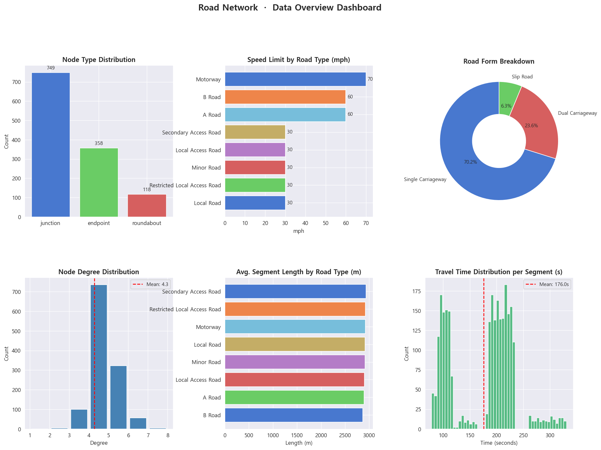
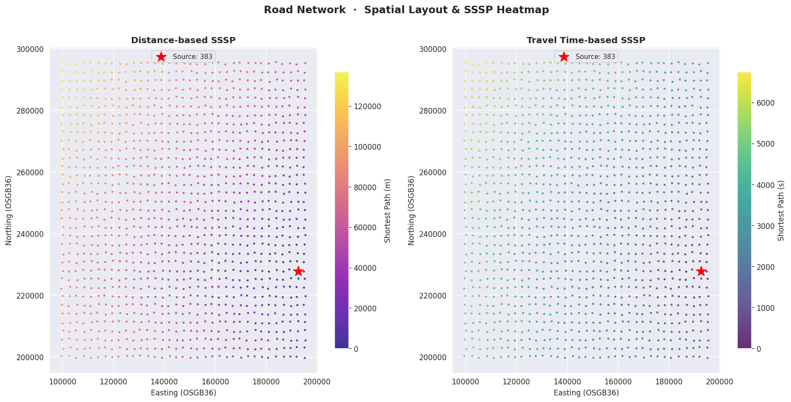
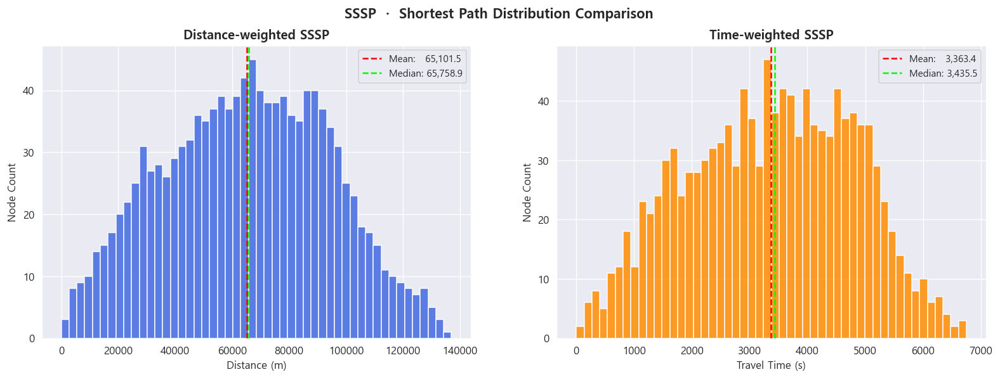
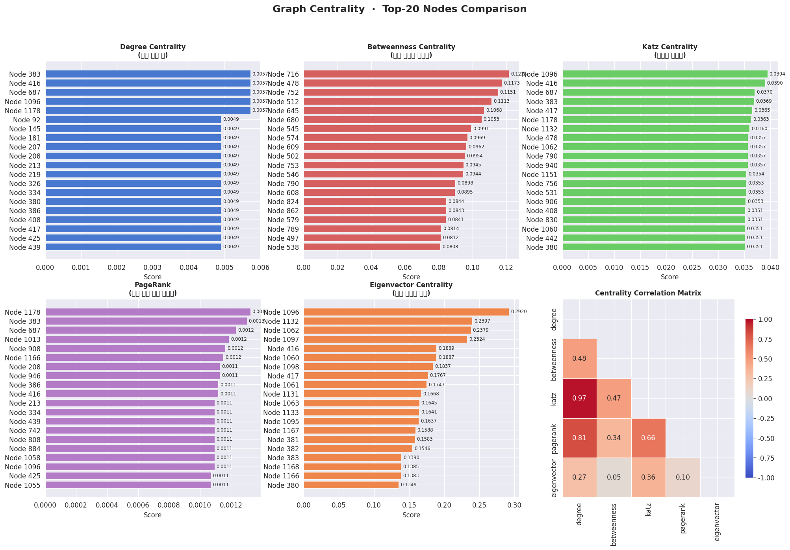
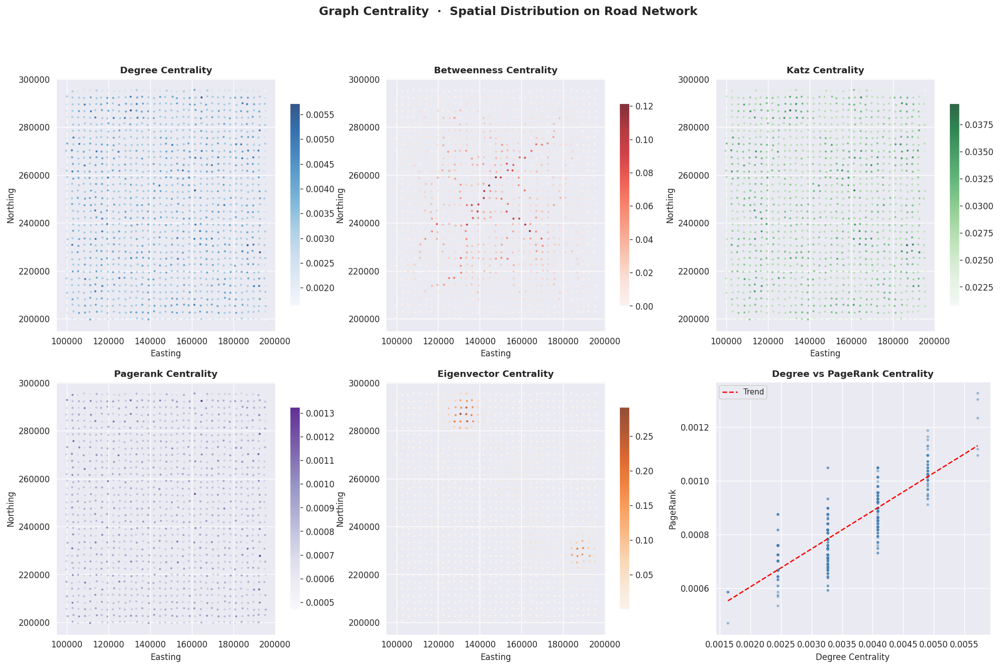
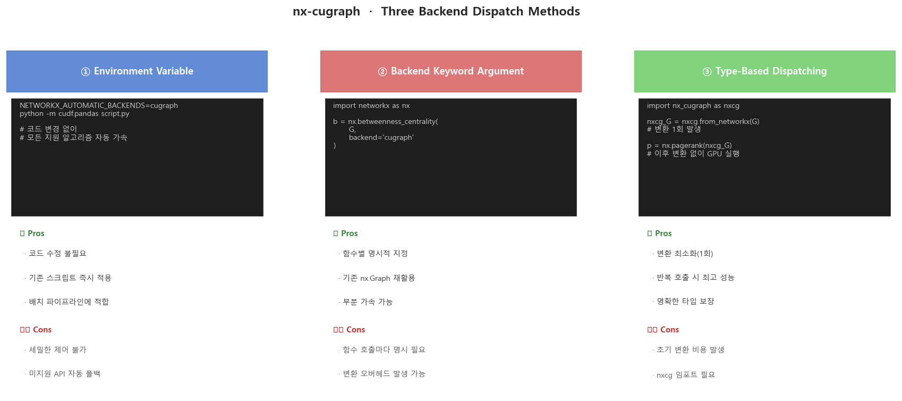
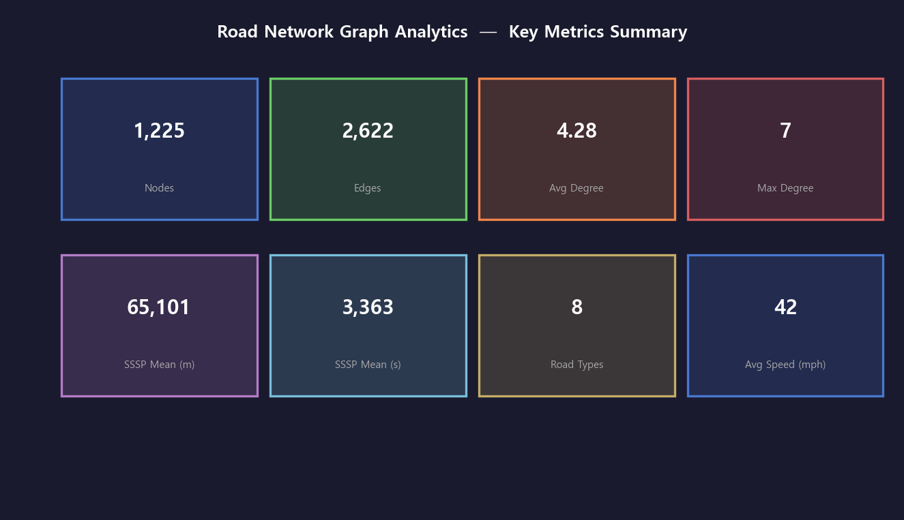

# 🛣️ Road Network Graph Analytics with GPU Acceleration
### NVIDIA DLI · Fundamentals of Accelerated Data Science 학습 기반 그래프 분석 파이프라인


---

## 📌 프로젝트 요약 (Project Overview)

이번 프로젝트는 NVIDIA DLI(Deep Learning Institute) 강좌 "Fundamentals of Accelerated Data Science"에서 학습한 GPU 가속 그래프 분석 내용을 포트폴리오 형태로 재구성한 프로젝트입니다. 영국 전체 도로망(Great Britain Road Network)을 본뜬 합성 데이터를 직접 설계하여, 데이터 수집부터 그래프 구축, 최단 경로 탐색, 중심성 분석까지 전체 파이프라인을 하나의 실행 스크립트로 완성했습니다.

해당 프로젝트는 cuDF/cuGraph 없이도 동일한 분석 흐름을 pandas + NetworkX로 재현할 수 있도록 설계했으며, 시각화 자료 7종을 자동으로 저장하여 분석 결과를 직관적으로 확인할 수 있습니다.

---

## 📂 프로젝트 구조 (Project Structure)

```text
road-network-graph-analytics/
├── plots/
│   ├── 01_data_overview.png           # 도로망 데이터 기초 통계 대시보드
│   ├── 02_sssp_spatial.png            # SSSP 결과 공간 히트맵 (거리 / 이동시간)
│   ├── 03_sssp_distribution.png       # SSSP 거리·시간 분포 비교
│   ├── 04_centrality_top20.png        # 중심성 5종 Top-20 노드 + 상관 행렬
│   ├── 05_centrality_spatial.png      # 중심성 공간 분포 + Degree vs PageRank
│   ├── 06_backend_methods.png         # nx-cugraph 3가지 백엔드 방식 정리
│   └── 07_summary_card.png            # 핵심 수치 요약 대시보드
├── src/
│   ├──main.py                         # 전체 분석 파이프라인 통합 실행 스크립트
├─ .gitignore                      
├─ LICENSE                         
├─ README.md                           # 프로젝트 개요 및 가이드 문서
└─ requirements.txt                    # 핵심 라이브러리 목록
```

---

## 🎯 핵심 학습 목표 (Motivation)

| 학습 키워드 | 핵심 구현 내용 및 목표 |
| :--- | :--- |
| **GPU 전처리 최적화** | cuGraph 입력 제약에 맞춰 문자열 노드 ID(`#`)를 정수 인덱스로 정제·매핑 |
| **피처 엔지니어링** | 제한 속도(mph)를 변환하여, 물리적 거리가 아닌 '실제 이동 시간(s)' 가중치 도출 |
| **알고리즘 가중치 해석** | '거리'와 '시간' 기반의 Dijkstra(SSSP)를 분리 실행하여 탐색 결과의 차이 증명 |
| **가속 추상화 레이어** | `nx-cugraph`의 3가지 백엔드 실행 방식별 장단점 및 트레이드오프 체계화 |
| **중심성의 다차원 분석** | 5종 중심성 지표 동시 산출 및 상관 행렬 분석을 통한 노드 중요도의 다각적 해석 |

---

## 🔍 분석 흐름 및 시각화 결과 (Pipeline & Results)  

| 단계 | 분석 과정 &emsp;&emsp;&emsp;&emsp;&emsp; | 상세 내용 및 시각화 |
| :---: | :--- | :--- |
| **Section 2** | **합성 도로망 생성** | 35×35 격자 기반 도로망 구성. 수평·수직·대각선 연결에 확률 기반 무작위 추가 연결 포함. GML 원본처럼 src_id에 `#` 접두사 부착하여 실제 전처리 흐름 재현 |
| **Section 3** | **데이터 전처리** | `str.lstrip('#')` ID 정규화 → 속도 제한 테이블 병합 → `length_s` 파생 변수 생성 → 정수 graph_id 매핑 |
| **Section 4** | **그래프 기본 분석** | 노드 1,225개 / 엣지 2,622개 / 평균 차수 4.28 확인. 차수 분포·도로 형태·속도 제한 시각화<br><br> |
| **Section 5–6** | **SSSP 분석** | 최고 차수 노드(Node 383, 차수 7)를 출발지로 거리(m) · 시간(s) 각각 Dijkstra 실행. SSSP 결과를 OSGB36 좌표에 색상으로 매핑하여 공간 히트맵 생성<br><br><br><br> |
| **Section 7** | **중심성 5종 분석** | Degree / Betweenness / Katz / PageRank / Eigenvector 각 알고리즘 실행. Top-20 노드 비교 + 지표 간 상관 행렬 도출<br><br><br><br> |
| **정리** | **nx-cugraph 백엔드 방식** | 3가지 활용 방식(환경변수 / 키워드 인수 / 타입 디스패치)을 코드 패턴·장단점과 함께 레퍼런스 플롯으로 정리<br><br><br><br> |

---

## 🛠️ 핵심 구현 기술 (Technical Implementation)

| 구현 항목 | 세부 내용 | 학습 포인트 |
| :--- | :--- | :--- |
| **합성 데이터 설계** | 영국 도로 유형(Motorway ~ Secondary Access Road) 8종과 실제 속도 제한 규정을 그대로 반영한 격자 기반 도로망 생성. 대각선·역대각선 연결 확률을 달리하여 비정형 밀도 재현 | 도메인 지식을 코드로 옮기는 데이터 설계 역량 |
| **전처리 파이프라인** | ID 정규화 → 속도 테이블 JOIN → `length_s = length / limit_m_s` 파생 변수 → 정수 graph_id 매핑까지 단일 함수로 통합. cuGraph의 정수 인덱스 요구사항에 맞춘 구조 | 그래프 라이브러리 입력 스펙에 맞는 전처리 설계 |
| **이중 가중치 SSSP** | 거리(m) · 이동 시간(s) 두 가지 가중치로 각각 Dijkstra 실행하여 결과 비교. 물리 거리 ≠ 이동 시간임을 시각적으로 증명 | 그래프 가중치의 의미론적 해석 능력 |
| **중심성 5종 비교** | Degree, Betweenness(k=300 샘플링), Katz, PageRank, Eigenvector를 순차 실행 후 상관 행렬 분석. 알고리즘별 Top 노드가 다름을 정량적으로 확인 | 네트워크 중요도 지표의 다차원 이해 |
| **nx-cugraph 3방식** | 환경변수 / 키워드 인수 / 타입 디스패치 방식의 코드 패턴·장단점을 레퍼런스 시각화로 정리. 실무 적용 시 기준점으로 활용 가능 | GPU 가속 추상화 레이어 활용법 체계화 |
| **공간 시각화** | OSGB36(영국 국가 좌표계) Easting/Northing 기반 산점도에 SSSP 거리·중심성 값을 컬러맵으로 매핑. 지리 정보 없이도 공간 패턴 해석 가능 | 그래프 분석 결과의 지리 공간적 시각화 |

---

## 📊 분석 결과 요약 (Results Summary)

### 그래프 기본 구조

| 지표 | 값 |
| :--- | :--- |
| 노드 수 | 1,225개 |
| 엣지 수 | 2,622개 |
| 평균 차수 | 4.28 |
| 최대 차수 | 7 |
| 연결 컴포넌트 | 1개 (전체 연결 그래프) |

### SSSP 결과 비교

| 구분 | 평균 | 최대 | 중앙값 |
| :--- | :--- | :--- | :--- |
| 거리 기반 (m) | 65,101 | 136,956 | 65,759 |
| 시간 기반 (s) | 3,363 | 6,752 | 3,436 |

### 중심성 지표별 Top-3 노드

| 알고리즘 | 정의 | Top-1 노드 | 특징 |
| :--- | :--- | :--- | :--- |
| **Degree** | 직접 연결 수 기반 | Node 383 | 격자 중심부의 교차점에 집중 |
| **Betweenness** | 최단 경로 경유 횟수 | Node 716 | Degree Top 노드와 불일치 → 교두보 역할 노드 별도 존재 |
| **Katz** | 직·간접 연결 전역 영향 | Node 1096 | 인근 고연결 노드를 많이 보유한 군집 중심 |
| **PageRank** | 링크 품질 가중 중요도 | Node 1178 | 중요한 노드들과 연결된 노드가 높은 점수 |
| **Eigenvector** | 이웃 중요도 합산 | Node 1096 | Katz와 유사 패턴이나 지역적 군집에 더 민감 |

> **인사이트**: Betweenness Centrality Top 노드가 Degree Top 노드와 다르게 나타남. 직접 연결이 많은 허브와 실제 정보 흐름의 병목(교두보) 역할을 하는 노드는 별개라는 점이 도로망 설계에 중요한 시사점을 제공함.

---

## ⚡ GPU 가속 원리: cuDF / cuGraph vs CPU 비교

| 구분 | CPU (pandas + NetworkX) | GPU (cuDF + cuGraph) |
| :--- | :--- | :--- |
| **데이터 적재** | pandas.read_csv | cudf.read_csv (GPU 메모리 직접 적재) |
| **그래프 구성** | nx.from_pandas_edgelist | G.from_cudf_edgelist |
| **SSSP** | nx.single_source_dijkstra | cg.sssp (CUDA 병렬 Bellman-Ford/Dijkstra) |
| **중심성** | nx.betweenness_centrality | nx.betweenness_centrality(backend='cugraph') |
| **대규모 성능** | 수백만 노드에서 수 시간 | 동일 규모에서 수 초 (약 100x~1000x 가속) |

---

## 💡 회고록 (Retrospective)

이번 포트폴리오 작성에 앞선 학습에서는 실제 GB 도로 데이터(GML 포맷)를 NVIDIA GPU 위에서 cuDF와 cuGraph로 분석했는데, 이 과정에서 가장 인상 깊었던 부분이 두 가지였습니다. 첫 번째는 수백만 개 노드·엣지로 구성된 거대한 도로망 그래프에서 SSSP(단일 출발지 최단 경로)를 CPU 대비 몇 배나 빠르게 풀어내는 장면이었고, 두 번째는 NetworkX라는 기존에 익숙한 라이브러리에 `backend='cugraph'`라는 인수 하나만 추가해도 GPU 가속이 적용된다는 점이었습니다. 알고리즘 자체가 아닌 '연산 기반(backend)'이라는 추상화 수준에서 가속을 제어한다는 발상이 굉장히 실용적이라고 느꼈습니다.

솔직히 처음 RAPIDS라는 이름을 들었을 때는 'GPU로 데이터 분석을 빠르게 한다'는 게 막연하게 느껴졌습니다. 딥러닝 모델 학습에 GPU를 쓰는 건 자연스럽게 받아들였는데, 데이터 전처리나 그래프 탐색 같은 알고리즘도 GPU로 가속한다는 발상이 처음엔 잘 와닿지 않았습니다. 하지만 영국 전체 도로망처럼 수백만 개의 노드와 엣지를 담은 그래프에서, CPU 기반 NetworkX로는 수분이 걸릴 최단 경로 계산을 cuGraph가 단 몇 초 만에 끝내는 장면을 보고나서는 이전에 가졌던 막연함이 사라졌습니다. 더 놀라웠던 건 그 코드가 `cg.sssp(G, source_vertex)` 한 줄이라는 점이었습니다. 단지 데이터가 CPU 메모리가 아닌 GPU 메모리에 올라가 있고, 내부적으로 수천 개의 CUDA 코어가 병렬로 경로를 탐색하고 있을 뿐 전혀 어렵고 복잡한 게 아니었습니다.

데이터 전처리 과정에서도 꽤 인상적인 경험이 있었습니다. 원본 GML 파일에서 추출된 도로 노드 ID가 `#osgb4000000029853419` 형태의 긴 문자열인데, cuGraph는 정수 인덱스만 입력으로 받습니다. 처음엔 왜 굳이 이런 제약이 있을까 불편하게 생각했는데, 생각해보면 당연한 이야기였습니다. GPU는 연속된 정수 인덱스로 배열에 접근할 때 가장 빠르게 동작하도록 설계되어 있기 때문에 그 제약이 불편함이 아니라, GPU 아키텍처에서 비롯된 필연적인 요구사항이라는 걸 이해하고 나니 전처리 파이프라인 설계 자체가 다르게 보이기 시작했습니다.

중심성 분석 파트에서는 예상치 못한 결과가 나와 오히려 더 많이 배웠습니다. 직접 연결이 가장 많은 허브 노드(Degree Centrality 1위)와 실제 정보 흐름의 병목이 되는 노드(Betweenness Centrality 1위)가 완전히 다른 노드였습니다. 도로망으로 비유하면, 차선이 많아서 넓은 교차로가 반드시 물류의 핵심 관문은 아닐 수 있다는 뜻입니다. 알고리즘마다 '중요함'의 정의가 근본적으로 다르기 때문에, 어떤 문제를 풀고 싶은지에 따라 지표를 선택해야 한다는 것을 직접 데이터로 확인하였습니다. 교과서에서 읽은 내용이 숫자로 증명되는 순간이라 매우 강렬하게 기억에 남았습니다.

이번 프로젝트의 합성 데이터는 규모가 작지만, 실제 수백만 노드짜리 GB 도로망에서도 파이프라인 구조 자체는 동일합니다. 데이터 규모가 커질수록 GPU 가속의 필요성도 커진다는 점에서, 이번 학습은 단순한 실습을 넘어 대용량 데이터 처리에 대한 시야를 넓히는 계기가 됐습니다. 앞으로는 실제 공공 도로 데이터(국가공간정보포털 등)를 활용하거나, 소셜 네트워크·물류 네트워크 등 다른 도메인의 그래프 문제에 이번 경험을 확장해 보고 싶습니다.

---

## 🔗 참고 자료 (References)

- NVIDIA Deep Learning Institute — Fundamentals of Accelerated Data Science
- cuGraph: GPU-Accelerated Graph Analytics (RAPIDS AI, 2024)
- nx-cugraph: NetworkX GPU Backend (RAPIDS AI, 2024)
- NetworkX: Network Analysis in Python (Hagberg et al., 2008)
- A Faster Algorithm for Betweenness Centrality (Brandes, 2001)
- PageRank: The Anatomy of a Large-Scale Hypertextual Web Search Engine (Page et al., 1998)
- RAC UK Speed Limits Guide (RAC, 2024)
- Geography Markup Language / GML (OGC Standard)
